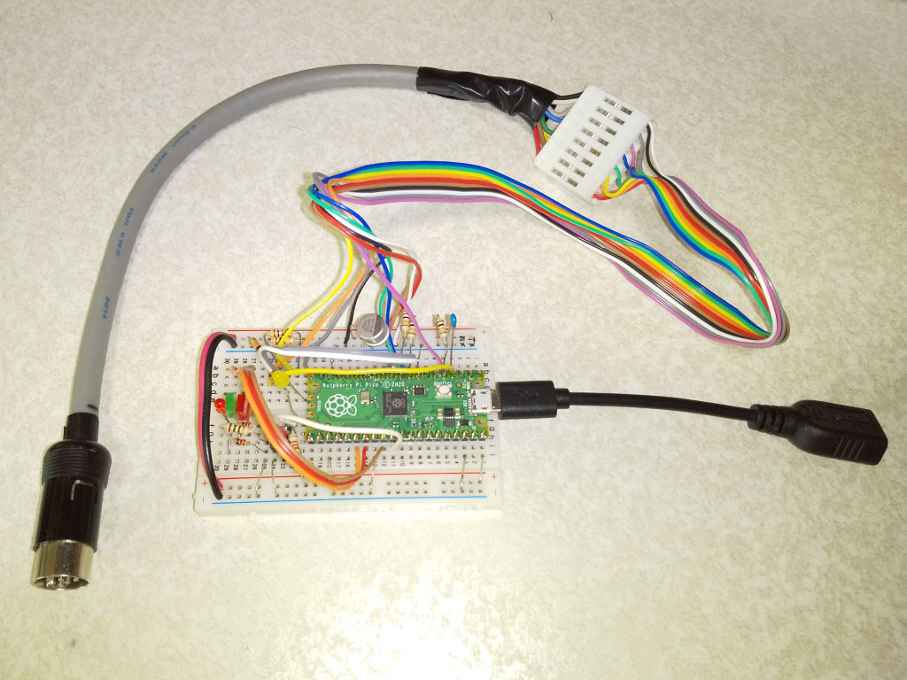
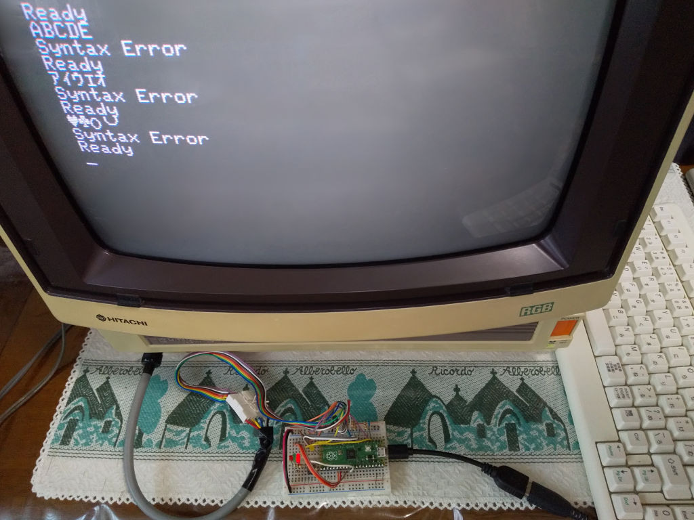

# USBキーボード for 日立 MB-S1  ラズパイPicoバージョン

## フォルダ構成

    Design/ ........................ ラズパイPico周りの回路設計
    Software/ ...................... ラズパイPico用ソフトウェア(Pico SDK v1.5.1 + Visual Code(Cmake))

### [PICマイコン版はこちら](https://github.com/bml3mk5/USBKeyboard4S1)

-----
# USBKeyboard for HITACHI MB-S1  Raspberry Pi Pico Version

## Folders

    Design/ ........................ The Circuit Design Around Raspberry Pi Pico
    Software/ ...................... Software for Raspberry Pi Pico (Pico SDK v1.5.1 + Visual Code(Cmake))

### [Here is the PIC microcontroller version](https://github.com/bml3mk5/USBKeyboard4S1)
